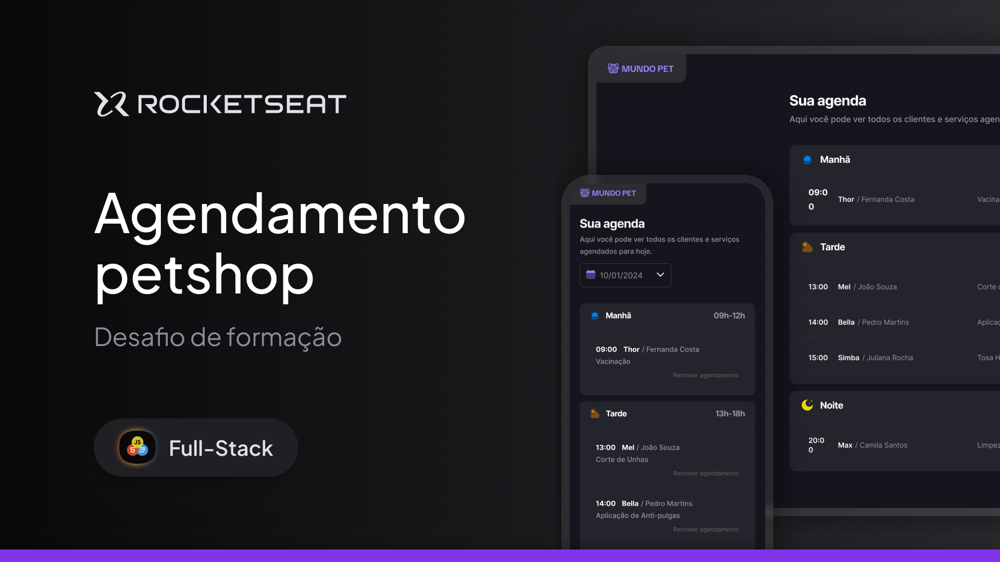
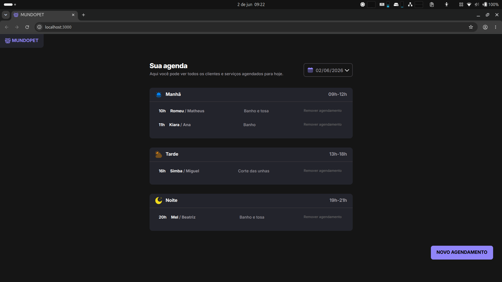
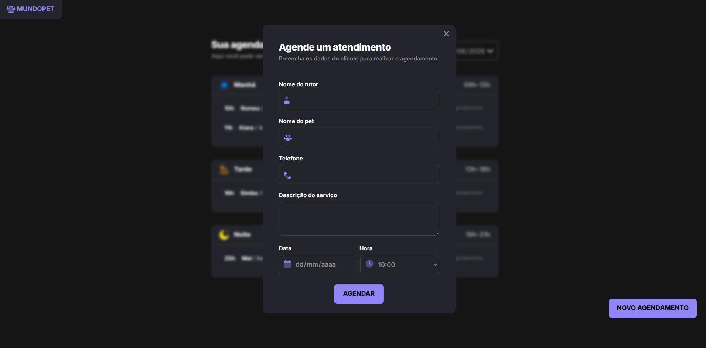

<p align="center">
  
</p>

# 🐾 MundoPet

Aplicação web para gerenciamento de agendamentos de serviços em Pet Shop, desenvolvida como desafio prático do curso **Especialista Full Stack** da Rocketseat.

---

## 🚀 Demonstração

### Agenda de Agendamentos



### Novo Agendamento



---

## 📋 Sobre o Projeto

O **MundoPet** é uma aplicação que permite gerenciar agendamentos de serviços para pets de forma simples e intuitiva.

A aplicação possibilita:

- Cadastrar novos atendimentos
- Visualizar agendamentos por período do dia
- Excluir agendamentos
- Validar datas e horários disponíveis
- Atualizar a interface dinamicamente sem recarregar a página

Este projeto foi desenvolvido para consolidar conhecimentos em JavaScript moderno, manipulação do DOM, consumo de APIs REST e organização de aplicações Front-end utilizando Webpack.

---

## ✨ Funcionalidades

- ✅ Cadastro de agendamentos
- ✅ Validação de campos do formulário
- ✅ Seleção de datas futuras
- ✅ Bloqueio automático de horários indisponíveis
- ✅ Listagem de atendimentos
- ✅ Separação por períodos:
  - 🌅 Manhã (09h às 12h)
  - ☀️ Tarde (13h às 18h)
  - 🌙 Noite (19h às 21h)
- ✅ Remoção de agendamentos
- ✅ Atualização automática da agenda

---

## 🛠️ Tecnologias Utilizadas

### Front-end

- HTML5
- SCSS
- JavaScript (ES6+)

### Bibliotecas

- Day.js

### Ferramentas

- Webpack
- Babel
- JSON Server

---

## 📁 Estrutura do Projeto

```bash
src
├── assets
│   ├── icons
│   └── images
│
├── libs
│
├── modules
│   ├── form
│   │   ├── form-time.js
│   │   ├── isEmpty.js
│   │   ├── overlay.js
│   │   └── submit.js
│   │
│   └── schedules
│       ├── load.js
│       └── showSchedules.js
│
├── services
│   ├── api-config.js
│   ├── delete.js
│   ├── deleteSchedule-by-id.js
│   ├── schedule-fetch-by-day.js
│   ├── schedule-fetch-by-id.js
│   └── schedule-new.js
│
├── styles
├── utils
└── main.js
```

---

## ⚙️ Instalação

Clone o repositório:

```bash
git clone https://github.com/seu-usuario/mundo-pet.git
```

Entre na pasta do projeto:

```bash
cd mundo-pet
```

Instale as dependências:

```bash
npm install
```

---

## ▶️ Executando o Projeto

### Inicie a API Fake

```bash
npm run server
```

Servidor disponível em:

```bash
http://localhost:3333
```

### Execute o ambiente de desenvolvimento

```bash
npm run dev
```

A aplicação ficará disponível em:

```bash
http://localhost:3000
```

---

## 📚 Conceitos Aplicados

Durante o desenvolvimento deste projeto foram praticados conceitos como:

- Manipulação de DOM
- Eventos
- Modularização de código
- Async/Await
- Fetch API
- Consumo de APIs REST
- Organização de componentes
- Gerenciamento de datas com Day.js
- Bundling com Webpack
- Transpilação com Babel

---

## 🎯 Objetivos do Desafio

- Aplicar JavaScript moderno em um projeto real
- Trabalhar com requisições HTTP
- Criar uma interface dinâmica
- Utilizar ferramentas do ecossistema Front-end
- Organizar o código de forma escalável

---

## 👨‍💻 Autor

Desenvolvido por **Matheus Souza** durante a formação **Especialista Full Stack** da Rocketseat.

---

## 📄 Licença

Este projeto foi desenvolvido para fins educacionais como parte dos estudos na Rocketseat.
